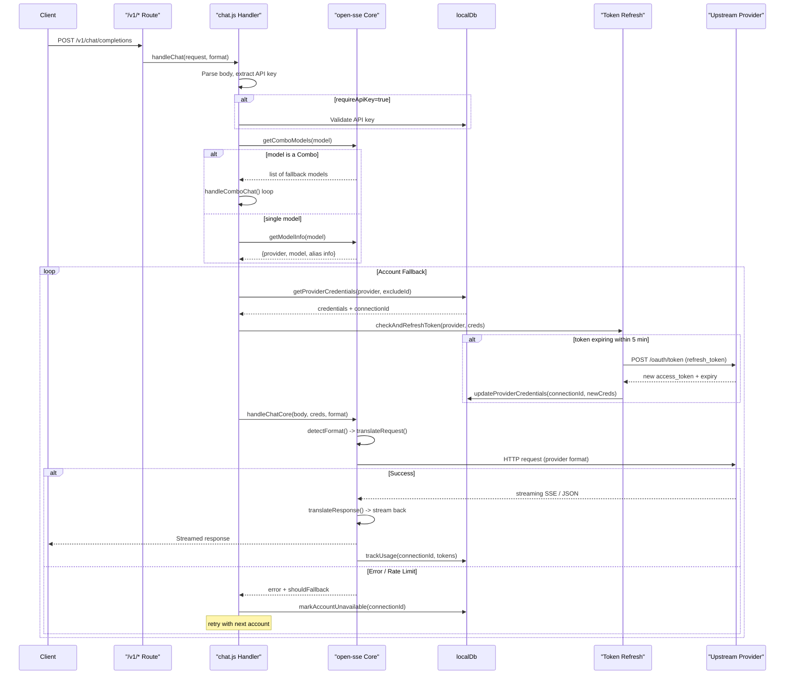
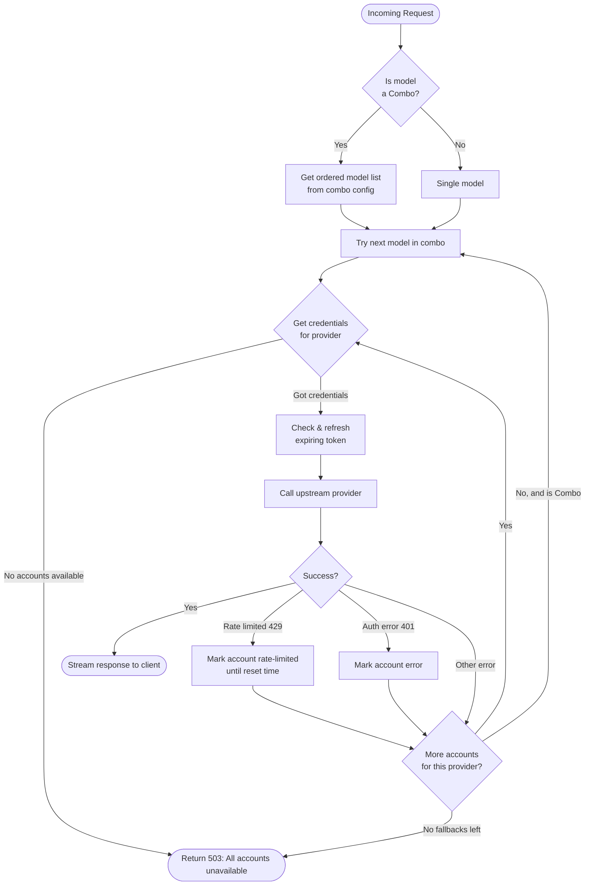
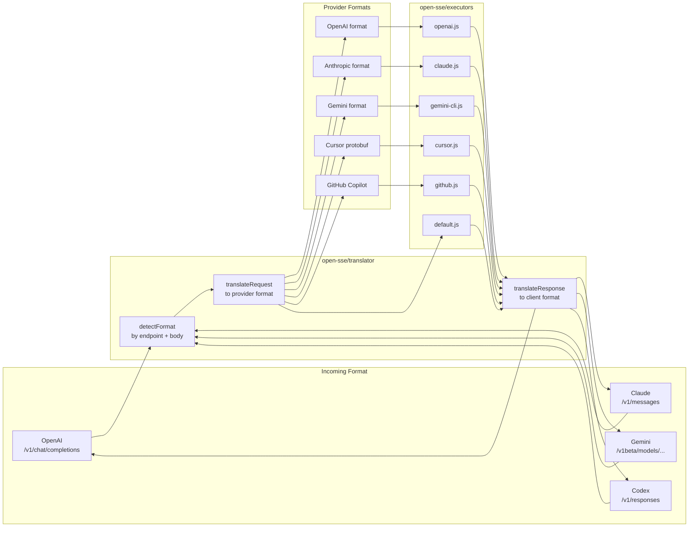
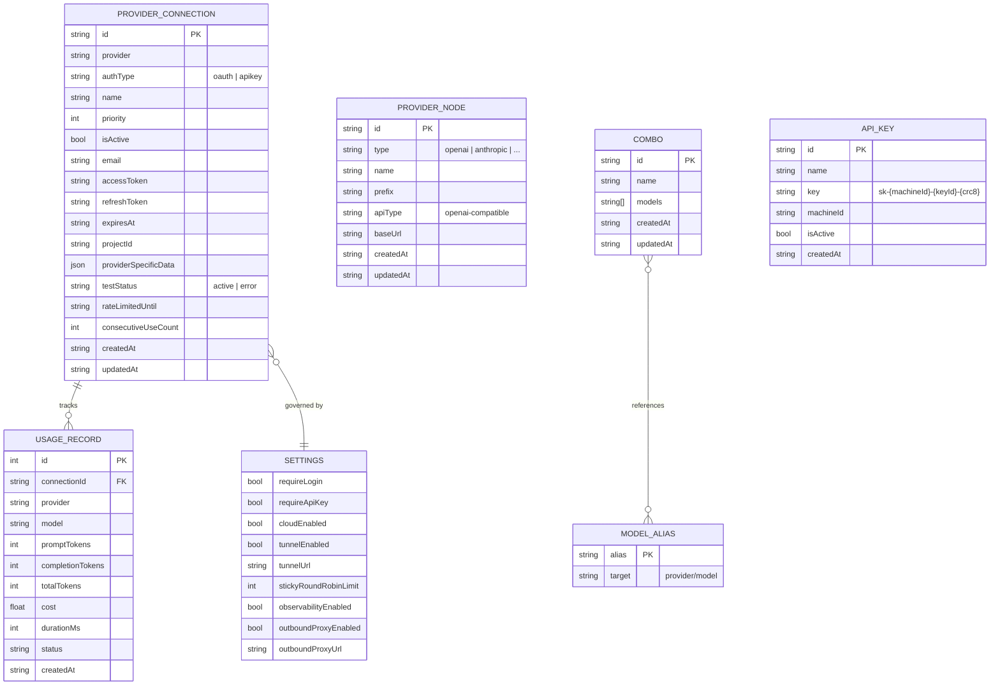
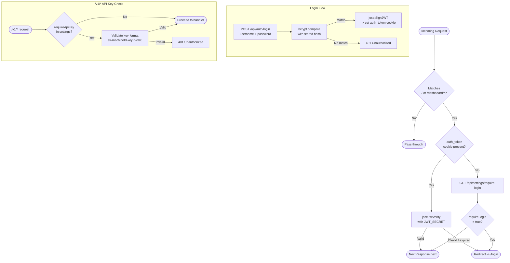
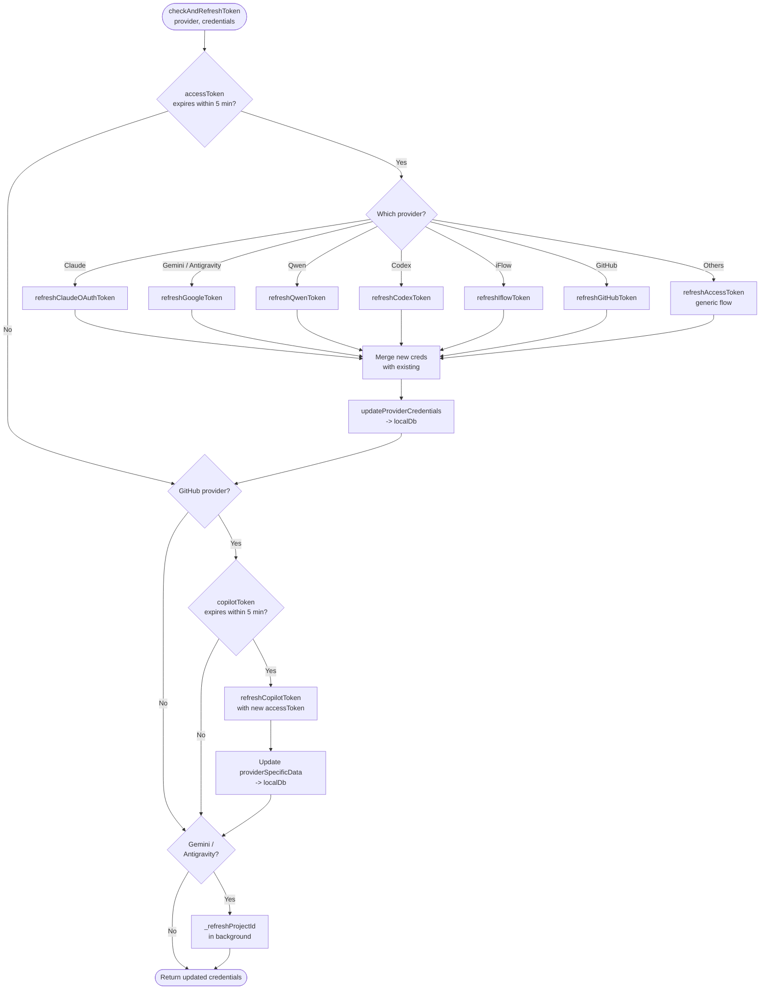

# 9Router – Architecture Diagrams

## 1. System Overview

```mermaid
graph TB
    subgraph Clients[Client Tools]
        CC[Claude Code]
        CX[Codex CLI]
        GC[Gemini CLI]
        CU[Cursor]
        CL[Cline / Continue / Roo]
        BR[Browser Dashboard]
    end

    subgraph Router[9Router (localhost:20128)]
        MW[Middleware<br>JWT Auth Guard]

        subgraph CompatAPI[Compatibility API  /v1/*]
            CHAT["/v1/chat/completions<br>OpenAI format"]
            MSG["/v1/messages<br>Claude format"]
            RESP["/v1/responses<br>Codex format"]
            EMB[/v1/embeddings]
            MOD[/v1/models]
        end

        subgraph Core[Routing Core (open-sse)]
            DETECT[Format Detection]
            TRANS[Request Translator]
            EXEC[Provider Executor]
            RTRANS[Response Translator]
            FALLBACK[Account Fallback]
        end

        subgraph MgmtAPI["Management API  /api/*"]
            PROV[/api/providers]
            OAUTH[/api/oauth/...]
            USAGE[/api/usage]
            SET[/api/settings]
            COMBO[/api/combos]
        end

        subgraph Persist["Persistence"]
            LDB[(lowdb<br>db.json)]
            SDB[(SQLite<br>usage.db)]
        end

        subgraph UI["Dashboard UI"]
            DASH[Dashboard Pages]
            STORE[Zustand Stores]
        end
    end

    subgraph Providers["Upstream AI Providers"]
        subgraph OAuth["OAuth"]
            PCLAUDE[Claude]
            PCODEX[Codex / OpenAI]
            PGEMINI[Gemini]
            PGITHUB[GitHub Copilot]
            PKIRO[Kiro]
            PCURSOR[Cursor]
            PQWEN[Qwen]
            PIFLOW[iFlow]
            PANTIGRAV[Antigravity]
        end
        subgraph APIKey["API Key"]
            POPENAI[OpenAI]
            PANTHRO[Anthropic]
            PROUTER[OpenRouter]
            PGLM[GLM / Kimi / MiniMax]
            PNODES[Custom Nodes]
        end
    end

    CC & CX & GC & CU & CL -->|HTTP POST /v1/*| MW
    BR -->|HTTP /dashboard/*| MW
    MW --> CompatAPI
    MW --> MgmtAPI
    MW --> UI

    CHAT & MSG & RESP & EMB --> DETECT
    DETECT --> TRANS --> EXEC --> RTRANS
    EXEC --> FALLBACK --> EXEC
    TRANS & RTRANS -.-> LDB
    FALLBACK -.-> LDB

    EXEC -->|HTTPS| OAuth
    EXEC -->|HTTPS| APIKey

    MgmtAPI <--> LDB
    MgmtAPI <--> SDB
    STORE <-->|fetch /api/*| MgmtAPI
    USAGE <--> SDB
```

---

## 2. Request Lifecycle (Sequence)



---

## 3. Provider Fallback Strategy



---

## 4. Format Translation Pipeline



---

## 5. Data Model



---

## 6. Authentication Flow



---

## 7. OAuth Token Refresh



---

## 8. Dashboard UI Structure

```mermaid
graph TD
    ROOT[src/app/layout.js<br>ThemeProvider + Stores] --> LOGIN[/login]
    ROOT --> LANDING[/landing]
    ROOT --> DLAYOUT[dashboard/layout.js<br>Sidebar + Header]

    DLAYOUT --> HOME[/dashboard<br>Overview]
    DLAYOUT --> PROV[/dashboard/providers<br>Provider List]
    DLAYOUT --> USAGE[/dashboard/usage<br>Usage & Charts]
    DLAYOUT --> COMBO[/dashboard/combos<br>Fallback Combos]
    DLAYOUT --> CLI[/dashboard/cli-tools<br>CLI Tool Setup]
    DLAYOUT --> EP[/dashboard/endpoint<br>API Docs]
    DLAYOUT --> TRANS[/dashboard/translator<br>Request Debugger]
    DLAYOUT --> MITM[/dashboard/mitm<br>MITM Proxy]
    DLAYOUT --> CONSOLE[/dashboard/console-log<br>Server Logs]
    DLAYOUT --> QUOTA[/dashboard/quota<br>Rate Limits]
    DLAYOUT --> PROFILE[/dashboard/profile<br>User Settings]

    PROV --> NEWPROV[/dashboard/providers/new]
    PROV --> EDITPROV[/dashboard/providers/:id]

    USAGE --> UOV[OverviewCards]
    USAGE --> UCHART[UsageChart<br>Recharts]
    USAGE --> UTABLE[UsageTable]
    USAGE --> UTOPO[ProviderTopology<br>XYFlow]
    USAGE --> UREQ[RequestDetailsTab]
    USAGE --> ULIMITS[ProviderLimits<br>QuotaProgressBar]

    CLI --> CLAUDE_CARD[ClaudeToolCard]
    CLI --> CODEX_CARD[CodexToolCard]
    CLI --> COPILOT_CARD[CopilotToolCard]
    CLI --> DROID_CARD[DroidToolCard]
    CLI --> OPENCLAW_CARD[OpenClawToolCard]
    CLI --> MITM_CARD[MitmServerCard]
```

---

## 9. Zustand State Management

```mermaid
graph LR
    subgraph Stores["src/store/"]
        TS[useThemeStore<br>theme: light|dark|system<br>-> localStorage]
        US[useUserStore<br>user profile<br>loading / error]
        PS[useProviderStore<br>providers[]<br>loading / error<br>fetchProviders]
        NS[useNotificationStore<br>notifications[]<br>auto-dismiss<br>success/error/warning/info]
    end

    subgraph APIs["Management APIs"]
        AP[/api/providers]
        AU[/api/auth]
        AS[/api/settings]
    end

    subgraph UI["Dashboard Components"]
        SIDEBAR[Sidebar]
        PROVPAGE[Providers Page]
        HEADER[Header]
        TOAST[Toast Notifications]
    end

    PS <-->|fetchProviders| AP
    US <-->|init| AU
    TS -->|applyTheme| DOM[document.documentElement<br>.classList]

    PROVPAGE --> PS
    HEADER --> US
    SIDEBAR --> TS
    TOAST --> NS
```
