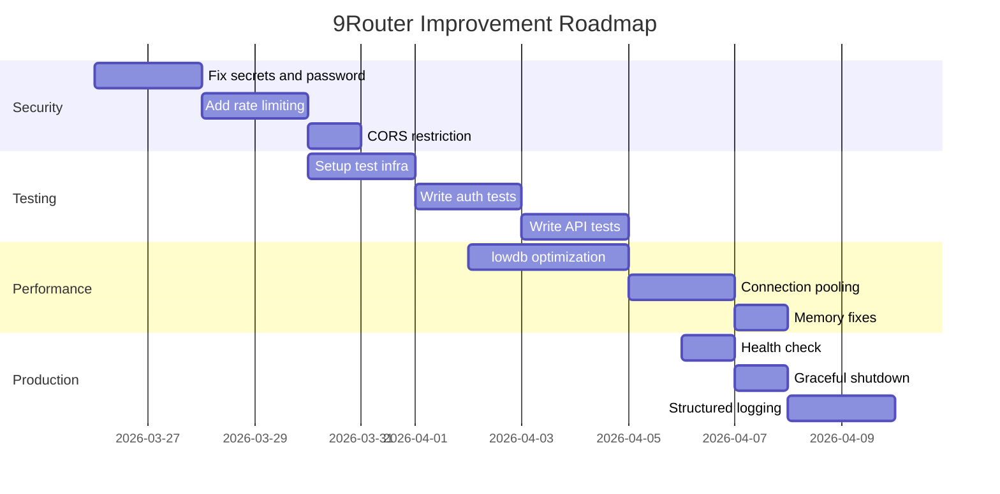

# 9Router Code Review Updates - March 25, 2026

## Latest Recommendations

### New Findings from Detailed Code Analysis

#### 1. Inconsistent Code Structure
- Files `localDb.js` (1116 lines) and `usageDb.js` (818 lines) are too large, need to be split into smaller modules
- Missing service layer - business logic resides directly in route handlers
- Inconsistent error responses: sometimes `{error: "msg"}`, sometimes `{success: false, error: "msg"}`

#### 2. Specific Performance Issues
- **lowdb optimization**: Every request calls `db.read()` and `db.write()`, should implement write batching
- **Memory leaks**: Global variables for pending requests and stats are not cleaned up
- **No connection pooling**: Each proxy URL creates a new dispatcher, does not reuse connections

#### 3. Missing Production Features
- **Health check endpoint**: No `/health` or `/api/health` for monitoring
- **Graceful shutdown**: Does not handle SIGTERM/SIGINT signals to close database connections
- **Structured logging**: Only uses `console.log/error`, lacks context and correlation IDs

#### 4. Specific Testing Gaps
- **No integration tests**: No tests for Provider Fallback System
- **No security tests**: No tests for authentication bypass, SQL injection, XSS
- **No load tests**: System capacity limits are unknown

### Updated Priority Recommendations

#### Week 1: Critical Security Fixes (Must do immediately)
1. **Fix hardcoded secrets** - Generate random secrets when environment variables are missing
2. **Remove default password "123456"** - Require first-time setup
3. **Add rate limiting for login** - Prevent brute force attacks
4. **Restrict CORS origins** - Do not use `Access-Control-Allow-Origin: *`

#### Week 2: Test Infrastructure (Necessary to maintain quality)
1. **Setup test framework** - Vitest configuration with test database
2. **Write auth tests** - Test login, JWT validation, password hashing
3. **Write API route tests** - Test `/v1/chat/completions`, fallback logic
4. **Write DB tests** - Test concurrent writes, data recovery

#### Week 3: Performance Optimization (Improve scalability)
1. **Implement write batching for lowdb** - Batch writes within 100ms window
2. **Add read caching** - Cache database reads with 5 seconds TTL
3. **Connection pooling** - Reuse HTTP connections for providers
4. **Memory leak fixes** - Cleanup global variables, implement TTL for caches

#### Week 4: Production Hardening (Prepare for deployment)
1. **Health check endpoint** - `/api/health` with database status
2. **Graceful shutdown** - Handle SIGTERM, close DB connections
3. **Structured logging** - JSON logs with request IDs
4. **Error tracking** - Integrate Sentry or similar service

### Quick Wins (Can be done immediately, low effort)
1. **Update `.env.example`** - Document all environment variables
2. **Add `.nvmrc`** - Specify Node.js version
3. **Add Docker Compose for development** - One-command setup
4. **Add pre-commit hooks** - Auto lint and test before commits

### Detailed Implementation Roadmap

### Progress Metrics to Track
- **Security score**: From 5/10 to 8/10
- **Test coverage**: From 2% to 40%
- **Performance**: From no benchmark to baseline metrics
- **Documentation**: From 4/10 to 7/10

### Risk Assessment
- **HIGH**: Security vulnerabilities can be exploited immediately
- **MEDIUM**: Performance issues will limit scalability with many users
- **LOW**: Documentation gaps affect developer experience

---

*This document contains the latest recommendations from the code review conducted on March 25, 2026. For the complete review report, see [CODE_REVIEW_REPORT.md](../../CODE_REVIEW_REPORT.md).*